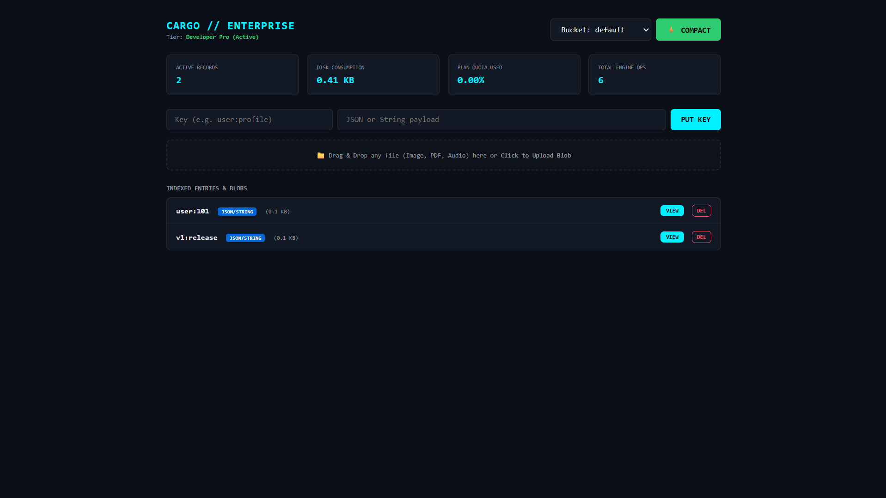

# CargoDB ⚡

[](https://opensource.org/licenses/MIT)
[](https://www.typescriptlang.org/)
[](https://nodejs.org/)



A high-performance, append-only key-value storage engine and binary blob store built with in-memory offset indexing, isolated multi-tenant bucketing, and automated zero-downtime compaction.

---

## Highlights

* **Append-Only Disk Log:** Fast sequential writes with crash recovery, eliminating in-place disk overwrite hazards.
* **In-Memory Offset Indexing:** Sub-millisecond $O(1)$ point lookups by seeking directly to byte offsets.
* **Multi-Tenant Partitioning:** Isolated data buckets (`default`, `assets`, `analytics`) with independent log structures.
* **Binary Blob Streaming:** Direct storage and streaming for files, images, and archives with preserved MIME metadata.
* **Zero-Downtime Compaction:** Background garbage collection reclaims disk space consumed by tombstones and overwritten keys.
* **Glassmorphic Web GUI:** Real-time console featuring telemetry inspection, record viewing, and drag-and-drop file uploads.
* **Complete Developer Tooling:** Native strongly typed TypeScript SDK alongside a global terminal CLI (`cargodb`).

---

## Architecture Overview

```text
               [ Put / Set / Upload / Delete ]
                              │
                              ▼
                 ┌─────────────────────────┐
                 │  Append-Only Disk Log   │ ──> Writes never mutate existing data
                 └─────────────────────────┘
                              │
                              ▼
                 ┌─────────────────────────┐
                 │ In-Memory Offset Table  │ ──> Maps Key ➔ { offset, length, mime }
                 └─────────────────────────┘
                              │
                              ▼
                      [ Reads: O(1) Seek ]